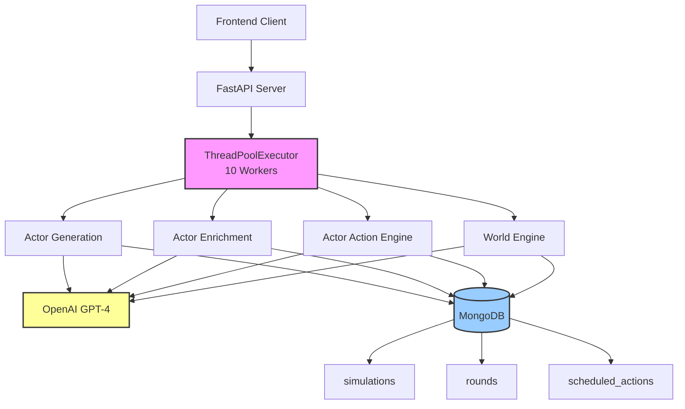
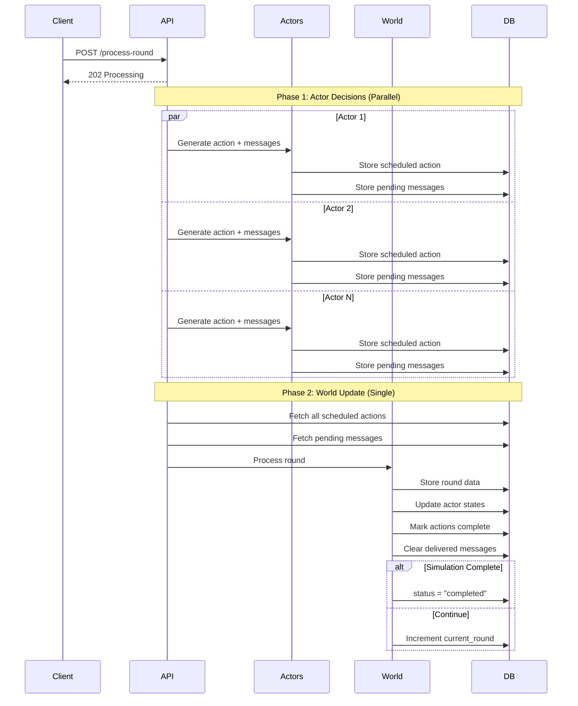
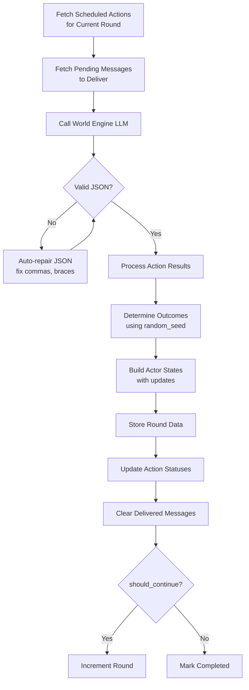
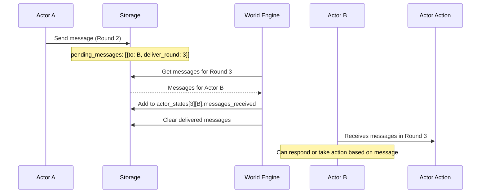
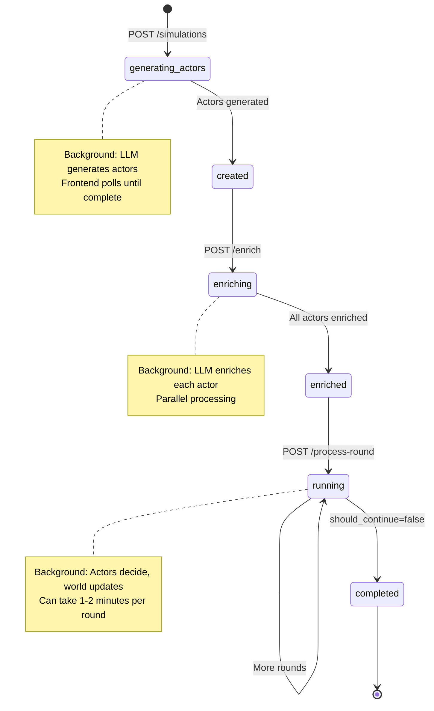

# Backend Architecture

**Actor-Actions Simulation System** - LLM-powered multi-agent simulations where autonomous actors make decisions, send messages, and evolve through discrete time steps.

---

## System Architecture



**Key Design Decisions:**
- **Async-First**: All I/O operations run in ThreadPoolExecutor to avoid blocking FastAPI event loop
- **LLM-Powered**: GPT-4 drives all simulation logic (actor decisions, world updates, outcomes)
- **MongoDB**: Flexible schema for evolving actor states and round history
- **Message Queue**: Inter-actor communication delivered in subsequent rounds

---

## Core Simulation Loop



---

## Data Model

### Simulation Document
```javascript
{
  simulation_id: "uuid",
  question: "What happens if the AI bubble pops?",
  status: "running",  // generating_actors → created → enriching → enriched → running → completed
  current_round: 3,
  time_unit: "Month",
  
  actors: [
    {
      actor_id: "uuid",
      identifier: "AI_Startups",  // Human-readable
      role_in_simulation: "Companies facing funding challenges...",
      goals: ["Achieve profitability", "Secure Series B"],
      capabilities: {technical: "high", capital: "limited"},
      constraints: ["Limited runway"]
    }
  ],
  
  // Private actor states by round
  actor_states: {
    "0": {"actor-uuid": {observations, available_actions, resources, messages_received, ...}},
    "1": {"actor-uuid": {...}},
    "2": {"actor-uuid": {...}}
  },
  
  // Messages waiting delivery
  pending_messages: [
    {
      from_actor_id: "uuid-1",
      from_actor_identifier: "AI_Startups",
      to_actor_id: "uuid-2", 
      to_actor_identifier: "Venture_Capitalists",
      content: "We've achieved profitability milestone",
      deliver_round: 3
    }
  ]
}
```

### Round Document (Public History)
```javascript
{
  simulation_id: "uuid",
  round_number: 3,
  world_state_summary: "Month 3: Enterprise adoption begins...",
  key_changes: ["B2B AI tools gaining traction", "Consumer spending down 60%"],
  action_results: [
    {
      actor_id: "uuid",
      action: "Launch enterprise pivot strategy",
      outcome: "SUCCESS",
      outcome_quality: "moderate"
    }
  ]
}
```

### Scheduled Action
```javascript
{
  simulation_id: "uuid",
  actor_id: "uuid",
  action: "Launch enterprise pivot",
  reasoning: "Consumer market too risky",
  scheduled_round: 3,
  duration: 2,  // Takes 2 rounds
  random_seed: 0.734,  // For outcome determination
  status: "pending"  // → completed/failed
}
```

---

## Actor Action Flow

**Input to Actor:**
```javascript
{
  world_state: "Market conditions deteriorating...",
  observations: "Competitors cutting costs...",
  available_actions: ["Pivot", "Cut costs", "Seek acquisition"],
  resources: {funding: "$4M", runway: "15 months"},
  messages_received: [
    {from_actor_identifier: "VCs", content: "Pausing investments"}
  ],
  other_actors: [{identifier: "Big_Tech", role: "..."}, ...]
}
```

**LLM Output:**
```javascript
{
  "actions": [
    {
      "action": "Launch enterprise pivot strategy",
      "reasoning": "Consumer market too risky",
      "execute_round": 3,
      "duration": 2
    }
  ],
  "messages": [
    {
      "to_actor_id": "Enterprise_Customers",
      "content": "New B2B offering with ROI guarantees",
      "reasoning": "Generate early enterprise interest"
    }
  ]
}
```

**Validation:**
- Actions: 0-3 per round
- Messages: 0-5 per round  
- Action text: ≤100 chars
- Message content: ≤200 chars
- `execute_round` ≥ current round
- `duration` ≥ 1

---

## World Engine Processing



**Outcome Logic:**
```python
difficulty = calculate_difficulty(action, actor_capabilities, world_state)

if action['random_seed'] > difficulty:
    outcome = "SUCCESS"
    quality = "strong" if random_seed > 0.7 else "moderate" if > 0.4 else "weak"
else:
    outcome = "FAILURE"
    quality = determine_failure_severity(random_seed, difficulty)
```

---

## Async Processing Strategy

### Problem
- PyMongo (MongoDB) is synchronous
- OpenAI client is synchronous
- FastAPI event loop cannot block
- Need concurrent actor processing

### Solution: ThreadPoolExecutor

```python
from concurrent.futures import ThreadPoolExecutor
import asyncio

executor = ThreadPoolExecutor(max_workers=10)

# Wrapper for all sync operations
async def async_storage_operation(func, *args, **kwargs):
    loop = asyncio.get_running_loop()
    return await loop.run_in_executor(executor, lambda: func(*args, **kwargs))

# Usage in endpoints
@app.get("/simulations")
async def list_simulations():
    sims = await async_storage_operation(storage.list_simulations)
    return sims

# Long-running operations
@app.post("/simulations/{id}/process-round")
async def process_round(simulation_id: str):
    loop = asyncio.get_running_loop()
    loop.run_in_executor(executor, _process_round_background, simulation_id)
    return {"status": "processing"}
```

### Processing Patterns

| Pattern | Use Case | Implementation |
|---------|----------|----------------|
| **Async Storage** | Fast DB queries | `await async_storage_operation()` |
| **BackgroundTasks** | Medium jobs (30-60s) | `background_tasks.add_task()` |
| **ThreadPool Executor** | Long jobs (1-5min) | `loop.run_in_executor()` |

---

## API Endpoints

| Method | Endpoint | Async Type | Description |
|--------|----------|------------|-------------|
| POST | `/simulations` | ThreadPool | Create + generate actors |
| GET | `/simulations` | Async Storage | List all simulations |
| GET | `/simulations/{id}` | Async Storage | Get simulation details |
| POST | `/simulations/{id}/enrich` | BackgroundTask | Enrich actors with LLM |
| POST | `/simulations/{id}/process-round` | ThreadPool | Process next round |
| GET | `/simulations/{id}/rounds` | Async Storage | Get round history |

---

## LLM Integration

### Prompt Structure

All engines follow consistent pattern:

```python
response = openai.ChatCompletion.create(
    model="gpt-4-turbo-preview",
    messages=[
        {"role": "system", "content": SYSTEM_PROMPT},
        {"role": "user", "content": user_prompt}
    ],
    max_tokens=max_tokens,
    temperature=0.7
)
```

### Token Allocation

| Engine | Max Tokens | Rationale |
|--------|-----------|-----------|
| Actor Generation | 8,000 | ~15 actors with details |
| Actor Enrichment | 8,000 | Per-actor depth |
| Actor Action | 8,000 | Actions + messages |
| World Engine | 32,000 | Large JSON with all actors |

### JSON Error Recovery

```python
def parse_llm_json(response_text: str) -> dict:
    # Stage 1: Extract from markdown
    json_str = extract_json_from_markdown(response_text)
    
    # Stage 2: Direct parse
    try:
        return json.loads(json_str)
    except json.JSONDecodeError:
        pass
    
    # Stage 3: Auto-repair
    repaired = json_str
    repaired = repaired.replace(',]', ']').replace(',}', '}')  # Trailing commas
    repaired = re.sub(r'\}\s*\n\s*"', '},\n"', repaired)  # Missing commas
    # Add missing closing braces...
    
    return json.loads(repaired)
```

---

## Performance Profile

### Latency

| Operation | Typical | Notes |
|-----------|---------|-------|
| Create Simulation | 15-30s | Actor generation LLM call |
| Enrich Actors | 30-60s | Multiple parallel LLM calls |
| Process Round | 45-120s | All actors + world update |
| Get Simulation | 50-200ms | MongoDB query |
| List Simulations | 100-300ms | MongoDB query |

### Scaling Considerations

**Current Limits:**
- 10 concurrent simulations (ThreadPool workers)
- 15 actors max per simulation (prompt size)
- ~1000 OpenAI requests/min (API rate limit)

**Bottlenecks:**
1. LLM API rate limits
2. World Engine token usage (20KB+ JSON responses)
3. Sequential world update (single LLM call)

**Future Optimizations:**
- Redis task queue (Celery) for distributed processing
- LLM response caching for similar scenarios
- Smaller world updates (only changed actors)

---

## Message System

### Flow



### Schema

**Sending:**
```javascript
{
  from_actor_id: "uuid-1",
  from_actor_identifier: "AI_Startups",
  to_actor_id: "uuid-2",
  to_actor_identifier: "Venture_Capitalists",
  content: "We've achieved profitability milestone",
  sent_round: 2,
  deliver_round: 3
}
```

**Receiving (in actor_states):**
```javascript
{
  from_actor_id: "uuid-1",
  from_actor_identifier: "AI_Startups",
  content: "We've achieved profitability milestone",
  sent_round: 2
}
```

---

## Simulation Lifecycle



---

## Code Organization

```
backend/src/
├── api.py                      # FastAPI endpoints, async orchestration
├── models.py                   # Pydantic schemas, validation
├── storage.py                  # MongoDB operations, data access
├── config.py                   # Environment configuration
├── prompts.py                  # LLM prompt templates
└── engines/
    ├── actor_generation.py     # Generate actors from question
    ├── actor_enrichment.py     # Add depth to actors
    ├── actor_action.py         # Generate actor decisions
    └── world_engine.py         # Process rounds, update world
```

**Key Stats:**
- `api.py`: 798 lines (endpoint logic + async wrappers)
- `world_engine.py`: 418 lines (core simulation logic)
- `prompts.py`: 408 lines (LLM prompt templates)
- `storage.py`: 382 lines (MongoDB CRUD operations)
- `models.py`: 371 lines (data schemas)

---

## Quick Reference

### Status Flow
```
generating_actors → created → enriching → enriched → running → completed
```

### Collections
- `simulations`: Main simulation documents with actors and actor_states
- `rounds`: Public round history (world state, action results)
- `scheduled_actions`: Pending actions with execution timing

### Async Patterns
- **Fast queries**: `await async_storage_operation()`
- **Medium jobs**: `background_tasks.add_task()`
- **Long jobs**: `loop.run_in_executor()`

### LLM Engines
1. **Actor Generation**: Question → Actors list
2. **Actor Enrichment**: Actor → Goals/capabilities/constraints
3. **Actor Action**: State → Actions + messages
4. **World Engine**: Actions → World update + outcomes

### Key Constraints
- Actions: 0-3 per actor per round
- Messages: 0-5 per actor per round
- Action text: ≤100 characters
- Message content: ≤200 characters
- Max actors: 15 per simulation

